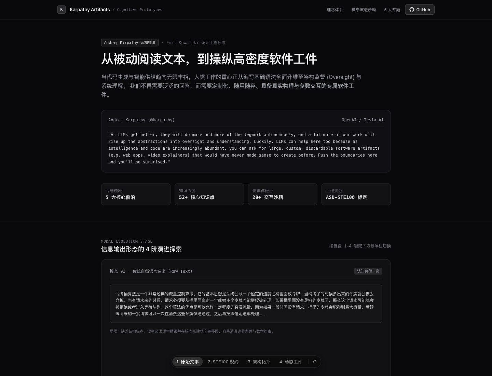

# 认知工件实验室 · AI Explainer Artifacts

通过独立交互页面探索前端、分布式系统、提示词工程及两位创作者的观点整理。

Interactive learning artifacts for frontend systems, distributed design, prompts and creator insights.

[在线体验](https://karpathy-deep-explainer-artifacts.xiaosang.cc/) · [源码](https://github.com/holynova/karpathy-deep-explainer-artifacts)



## 可以做什么

- 五个专题页面提供图解与交互实验。
- 通过原型选择器比较同一主题的不同展示。

## 选择一个专题

- [前端系统设计](./frontend-system-design.html)
- [分布式系统设计](./backend-system-design.html)
- [提示词工程](./prompt-engineering.html)
- [Zara Zhang观点整理](./zara-zhang-insights.html)
- [Matt Pocock工程观点](./matt-pocock-insights.html)

观点页面是项目作者的学习整理，不代表人物本人审核或完整思想体系。交互模型用于学习，不是生产系统实现。

## 本地运行

```bash
python3 -m http.server 8080
```

打开 http://localhost:8080/。使用本地HTTP服务即可，无需安装前端框架。


## 发布

```bash
npx --yes wrangler@4.128.0 deploy --dry-run --config wrangler.jsonc
npx --yes wrangler@4.128.0 deploy --config wrangler.jsonc
```

从 `main` 同一提交在本地手动发布到Cloudflare Workers。正式地址：[https://karpathy-deep-explainer-artifacts.xiaosang.cc/](https://karpathy-deep-explainer-artifacts.xiaosang.cc/)。 `.assetsignore` 限定公开播放器/站点资源，排除合成工程、开发文件与未供页面使用的大体积音频/字体。
